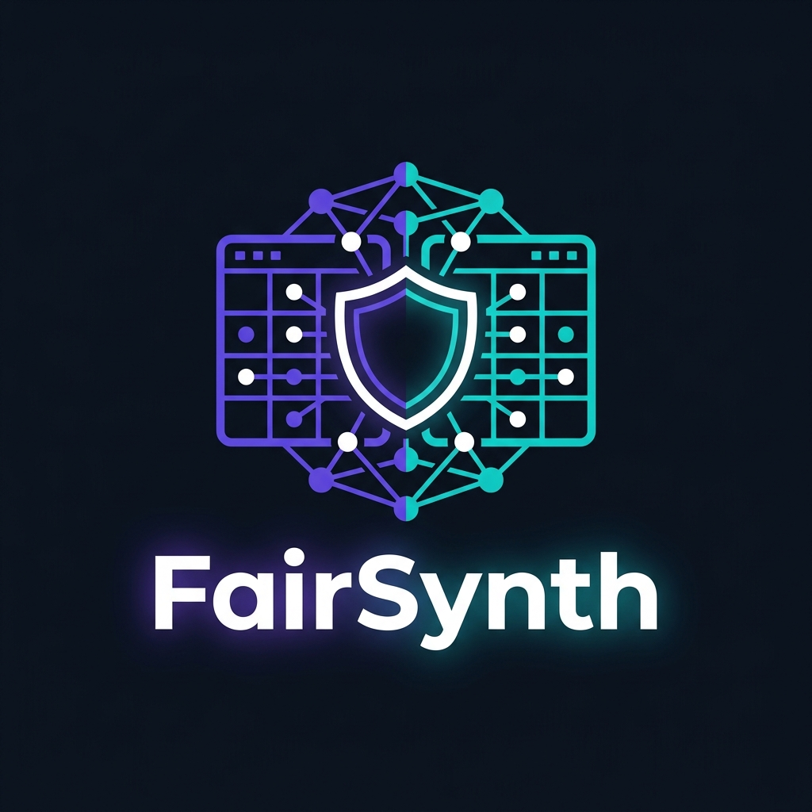

<div align="center">
  
  <h1>FairSynth AI</h1>
  <p><strong>Local, Privacy-First Synthetic Data Generation with Multi-Agent Compliance Intelligence</strong></p>
  <p>
    
    
    
    
    
  </p>
</div>

---

## What is FairSynth?

FairSynth is a **fully local, multi-agent AI system** that generates high-fidelity synthetic datasets with formal differential privacy guarantees. It works on any tabular dataset — HR hiring, medical records, financial transactions, legal case data — without sending a single row of your data to the cloud.

### Core Capabilities

| Feature | What It Does |
|---|---|
| 🤖 **Multi-Agent Pipeline** | 7+ specialized AI agents coordinate synthesis, compliance, validation, and analysis |
| 🔒 **Differential Privacy** | DP-CTGAN via SmartNoise applies formal ε-differential privacy in-training |
| 🧠 **RAG Compliance** | ChromaDB + Ollama retrieves HIPAA, GDPR, GLBA, EEOC rules and maps them to columns |
| 📊 **Pattern Analysis** | Blind LLM analysis proves statistical pattern preservation without hallucination |
| 🎯 **Fine-Tune Pipeline** | Creates custom Ollama models pre-loaded with your synthetic dataset for Q&A |
| 🗂️ **Any Dataset** | Works on HR, medical, financial, legal data — no hardcoded column names |
| 📄 **Compliance Certificate** | Generates a PDF audit certificate with regulation citations, epsilon budgets, and quality scores |
| 👁️ **Human-in-the-Loop** | Review and override AI decisions before synthesis starts |

---

## Architecture

```
┌─────────────────────────────────────────────────────────┐
│                      Frontend (HTML/JS)                 │
│   Core Pipeline │ Bias Audit │ Pattern Analysis │ Chat  │
└────────────────────────┬────────────────────────────────┘
                         │ FastAPI REST + WebSocket
┌────────────────────────▼────────────────────────────────┐
│                    Backend/main.py                      │
│              GenerationBridge (adapter)                 │
└────────────────────────┬────────────────────────────────┘
                         │ imports generation/
┌────────────────────────▼────────────────────────────────┐
│                   generation/                           │
│                                                         │
│  ┌─────────────┐  ┌──────────────┐  ┌───────────────┐  │
│  │   Profiler  │→ │  Compliance  │→ │   Generator   │  │
│  │   Agent     │  │  Agent (RAG) │  │  (DP-CTGAN)   │  │
│  └─────────────┘  └──────────────┘  └───────┬───────┘  │
│                                             │           │
│  ┌─────────────┐  ┌──────────────┐          ▼           │
│  │  Validator  │← │   Pattern    │  ┌───────────────┐  │
│  │   Agent     │  │   Analyst    │  │  Synthetic    │  │
│  └─────────────┘  └──────────────┘  │  Dataset CSV  │  │
│                                     └───────────────┘  │
│  ┌──────────────────────────────────────────────────┐   │
│  │           LangGraph Orchestration                │   │
│  └──────────────────────────────────────────────────┘   │
└─────────────────────────────────────────────────────────┘
```

---

## Quick Start

### Prerequisites

```bash
pip install -r generation/requirements.txt
pip install -r Backend/requirements.txt

# Ollama — https://ollama.ai
ollama pull qwen2.5:7b
ollama pull llama3.2:3b
ollama pull nomic-embed-text
```

### Run

```bash
cd Backend
uvicorn main:app --reload --port 8000
# Open frontend/index.html in browser
```

---

## Pipeline Phases

```
UPLOAD → PROFILING → COMPLIANCE → AWAITING_APPROVAL → GENERATING → VALIDATING → COMPLETE
```

| Phase | Agent | Description |
|---|---|---|
| **PROFILING** | Schema Profiler (Qwen2.5:7b) | Classifies each column as PII / PHI / SENSITIVE / SAFE |
| **COMPLIANCE** | RAG Compliance (Qwen2.5:7b + ChromaDB) | Assigns SUPPRESS/GENERALIZE/RETAIN_WITH_NOISE/RETAIN with regulation citations |
| **AWAITING_APPROVAL** | Human-in-the-Loop | User reviews and overrides AI decisions, sets epsilon budgets |
| **GENERATING** | DP-CTGAN (SmartNoise) | Trains GAN with formal ε-DP, generates synthetic rows |
| **VALIDATING** | Validator + SDMetrics | KS scores, TVD for categorical columns, correlation similarity |
| **COMPLETE** | Certificate Generator | PDF with quality metrics, epsilon budgets, regulation citations |

---

## Compliance Actions

| Action | Applied To | What Happens |
|---|---|---|
| `SUPPRESS` | SSNs, patient IDs, account numbers | Column removed from synthetic output |
| `PSEUDONYMIZE` | Names, emails | Faker generates realistic but fake replacements |
| `GENERALIZE` | Age, ZIP codes, birth years | Values bucketed into ranges (30–39, 900XX) |
| `RETAIN_WITH_NOISE` | Gender, salary, scores, outcomes | DP-CTGAN applies ε-DP noise during training |
| `RETAIN` | Department, job rank, public flags | Synthesized normally |

---

## Privacy Budget (Epsilon)

> `global_ε = max(per-column ε values)`

- Adding more sensitive columns does **not** silently weaken the privacy guarantee
- Certificate accurately reports the global ε used during GAN training
- Binary columns (0/1): ε ≥ 5.0 recommended to prevent value corruption

---

## Pattern Analysis Agent — Anti-Hallucination Design

1. Computes a statistical fingerprint of the **original** dataset (pure numbers)
2. Computes a statistical fingerprint of the **synthetic** dataset (pure numbers)
3. LLM receives **only the statistics** — never knows which is "original" vs "synthetic"
4. Computes per-column drift mathematically
5. LLM writes a comparison narrative based purely on drift data

This prevents the LLM from saying "the data looks good" because it knows it just generated it.

---

## Local Model Fine-Tuning

```json
POST /api/finetune/start/{job_id}
{"base_model": "llama3.2:3b", "max_context_rows": 200}
```

The system auto-generates a domain-aware system prompt, embeds dataset rows as context, runs `ollama create`, and exposes a chat endpoint for dataset-specific Q&A.

---

## API Reference

| Method | Endpoint | Description |
|---|---|---|
| `POST` | `/api/upload-dataset` | Upload CSV/JSON/Parquet |
| `POST` | `/api/start-pipeline/{job_id}` | Begin AI pipeline |
| `GET` | `/api/results/{job_id}` | Column classifications |
| `POST` | `/api/approve-plan/{job_id}` | Submit human approval |
| `GET` | `/api/download/{job_id}/{file_type}` | Download outputs |
| `POST` | `/api/analyze-pattern/{job_id}` | Run blind pattern analysis |
| `GET` | `/api/pattern-report/{job_id}` | Get cached pattern report |
| `GET` | `/api/finetune/models` | List available Ollama models |
| `POST` | `/api/finetune/start/{job_id}` | Start model creation |
| `GET` | `/api/finetune/status/{job_id}` | Poll training status |
| `POST` | `/api/finetune/chat/{job_id}` | Chat with trained model |
| `POST` | `/api/bias-audit/start` | Start bias audit |
| `WS` | `/ws/{job_id}` | Real-time pipeline events |

---

## Environment Setup

Create `generation/.env`:

```env
OLLAMA_BASE_URL=http://localhost:11434
PRIMARY_MODEL=qwen2.5:7b
SECONDARY_MODEL=llama3.2:3b
EMBEDDING_MODEL=nomic-embed-text
CHROMADB_PATH=./chroma_db
CHROMADB_COLLECTION=fairsynth_compliance_kb
```

---

## Project Structure

```
Antraa/
├── logo.png
├── README.md
├── Backend/
│   ├── main.py                     # FastAPI app + all endpoints
│   └── generation_bridge.py        # Backend ↔ generation/ adapter
└── generation/
    ├── agents/
    │   ├── profiler_agent.py        # Schema classification
    │   ├── compliance_agent.py      # RAG compliance mapping
    │   ├── validator_agent.py       # Quality narration
    │   ├── pattern_analyst_agent.py # Blind pattern analysis (NEW)
    │   ├── bias_profiler_agent.py
    │   ├── bias_metrics_agent.py
    │   └── bias_interpreter_agent.py
    ├── synthesis/
    │   └── generator.py             # DP-CTGAN synthesis engine
    ├── pipeline/
    │   └── core_pipeline.py         # LangGraph orchestration
    └── rag/
        └── embeddings.py            # Ollama + ChromaDB
```

---

<div align="center">
  <sub>Built with FastAPI · SmartNoise · SDV · LangGraph · ChromaDB · Ollama</sub>
</div>